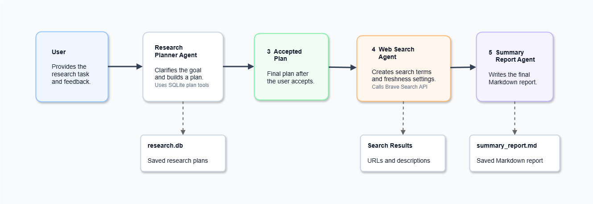
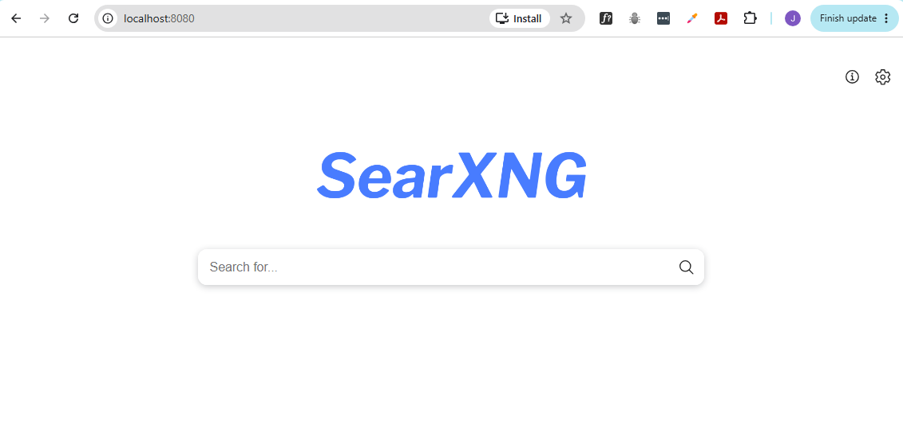

# Multi-Agent Research Workflow

## Overview

This project builds a command-line research assistant that splits a research workflow across focused agents.

Instead of asking one agent to plan, search, and summarize everything, the app moves through three stages: 

1. Planning the research task
2. Searching the web for relevant results
3. Generating a Markdown summary report

Each agent owns one part of the workflow.

| Agent                  | Purpose                                                            |
| ---------------------- | ------------------------------------------------------------------ |
| `ResearchPlannerAgent` | Helps the user create and store a research plan.                   |
| `WebSearchAgent`       | Converts the research plan into search terms and searches the web. |
| `SummaryReportAgent`   | Summarizes the search results into a Markdown report.              |

The final report is saved to:

```text
reports/summary_report.md
```

<div class='img-center'>



</div>

## Objectives 

The goals of this project are to demonstrate:

- How to split one workflow across multiple agents.
- How to use tool calling for database-backed actions.
- How to externalize prompts and SQL.
- How to use Pydantic for structured model output.
- How to call a search API from an agent workflow.
- How to generate a Markdown report from search results.

## Use Cases

Research tasks often involve multiple steps, and each step requires a different type of reasoning.

Instead of having one agent handle everything, a multi-agent workflow divides the process into smaller, focused tasks. This makes the workflow easier to understand, test, and improve.

Typical research steps include:

1. Understanding the research goal
2. Planning what information to find
3. Searching the web
4. Summarizing the results
5. Providing source links for verification

This project demonstrates how a research workflow can be split across multiple specialized agents, with each agent responsible for a specific part of the process.


## Workflow

The workflow runs in sequence, with each agent handling one focused responsibility before handing off to the next.

1. Initialize the local SQLite database.
2. Start the research planner agent.
3. The user describes a research task.
4. The planner agent helps refine the plan and can store, list, or delete saved plans.
5. The user types `accept` when the plan is ready.
6. The web search agent turns the plan into structured search terms.
7. ~~The app calls the Brave Search API for each search term and gets back results.~~
8. The app calls the local SearxNG search API for each search term.
9. The summary report agent writes a Markdown report from the search results.
10. The app saves the report to `reports/summary_report.md`.

**UPDATE:** Brave Search API has removed the free tier. As an alternative, this project uses SearxNG as a free local search engine API. The code has been updated to use SearxNG instead of Brave Search.

Note that SearxNG needs to run locally first. The installation steps are added in the [Setup - Searx](#setup---searx) section below.


## Project Structure

```text
05-multi-agent-research-workflow/
|
├── prompts/
│   ├── research-planner-agent.txt
│   ├── summary-report-agent.txt
│   └── web-search-agent.txt
|
├── diagrams/
│   ├── multi-agent-research-workflow.drawio
│   └── multi-agent-research-workflow.png
|
├── reports/
|
├── sql/
│   ├── create_research_plans_table.sql
│   ├── delete_research_plan.sql
│   ├── get_research_plans.sql
│   └── insert_research_plan.sql
|
├── agents.py
├── database.py
├── file_utils.py
├── main.py
├── schemas.py
├── search_client.py
├── tools.py
|
├── .env.example
├── pyproject.toml
├── uv.lock
└── README.md
```

## Prerequisites

- [Python 3.12+](https://www.python.org/downloads/)
- [uv](https://docs.astral.sh/uv/getting-started/installation/)
- [An OpenAI account](https://platform.openai.com/login)
- [OpenAI API credentials](https://platform.openai.com/account/api-keys)
- ~~A Brave Search API key (optional, see update above about SearxNG)~~
- [Docker Desktop/Docker](https://docs.docker.com/engine/install/)
- [jq](https://jqlang.org/download/)

## Setup

### Environtment 

1. Go to this project folder.

    ```bash
    cd project-llm-engineering-sandbox/building-ai-agents/05-multi-agent-research-workflow
    ```

2. Copy the environment file.

    ```bash
    cp .env.example .env
    ```

3. Configure environment variables.

    ```env
    OPENAI_API_KEY=your_openai_key_here
    OPENAI_BASE_URL=https://api.openai.com/v1
    MODEL_NAME=gpt-5-nano

    #### BRAVE_API_KEY=your_brave_api_key_here

    SEARXNG_URL=http://localhost:8080
    SEARXNG_SECRET=your_generated_searxng_secret_here
    ```

    **Note:** Never commit real API keys to source control.

4. Install dependencies.

    ```bash
    uv sync
    ```


### Searx 

Since Brave Search API has removed the free tier, we'll use SearxNG as an alternative search engine API that can run locally for free.

<!-- SearxNG runs locally, so the app can search without a paid search API key. -->

This project performs live web search through the local SearxNG container, so Docker/Docker Desktop must be running and `SEARXNG_URL` must point to the local SearxNG URL.


1. Install Docker Desktop.

    Linux/Mac: Install Docker Engine from the official Docker installation page:

    ```text
    https://docs.docker.com/engine/install/
    ```

    Windows: Download Docker Desktop from the official Docker installation page:

    ```text
    https://docs.docker.com/desktop/setup/install/windows-install/
    ```

    Run `Docker Desktop Installer.exe`, keep the WSL 2 backend selected when prompted, finish the wizard, and start Docker Desktop.

    After Docker Desktop starts, verify Docker from a terminal:

    ```bash
    docker --version
    docker run hello-world
    ```

2. Create a local directory for the SearxNG configuration.

    Windows/PowerShell: 

    ```powershell
    New-Item -ItemType Directory -Force -Path searxng
    ```

    MacOS, Linux, Git Bash, or WSL:

    ```bash
    mkdir -p searxng
    ```

3. Copy the SearxNG config from the example file in this repository.

    Windows/PowerShell:

    ```powershell
    Copy-Item searxng/settings.yml.example searxng/settings.yml
    ```

    MacOS, Linux, Git Bash, or WSL:

    ```bash
    cp searxng/settings.yml.example searxng/settings.yml
    ```

    The `searxng/settings.yml.example` file is safe to commit. The copied `searxng/settings.yml` file is for your local machine and is ignored by Git.

4. Generate a local SearxNG secret.

    SearxNG uses `server.secret_key` for cryptographic internals. You do not get this key from SearxNG or from an external service. Generate a random value locally and keep it in your uncommitted `.env` file.

    PowerShell:

    ```powershell
    -join ((48..57 + 65..90 + 97..122) | Get-Random -Count 64 | ForEach-Object {[char]$_})
    ```

    MacOS, Linux, Git Bash, or WSL:

    ```bash
    openssl rand -hex 32
    ```

    Add the generated value to `.env`:

    ```env
    SEARXNG_SECRET=your_generated_secret_here
    SEARXNG_URL=http://localhost:8080
    ```

    Docker passes this value into the SearxNG container with `--env-file .env`. SearxNG maps `SEARXNG_SECRET` to `server.secret_key`.

5. Review `searxng/settings.yml`.

    SearxNG's JSON output must be enabled before the Python client can call `format=json`.

    ```yaml
    use_default_settings: true

    server:
      bind_address: "0.0.0.0"
      port: 8080

    search:
      formats:
        - html
        - json
    ```

6. Start SearxNG with Docker.

    Windows/PowerShell:

    ```powershell
    docker run --name searxng-local -d -p 8080:8080 --env-file .env -v "${PWD}/searxng:/etc/searxng" searxng/searxng:latest
    ```

    MacOS, Linux, Git Bash, or WSL:

    ```bash
    docker run --name searxng-local \
      -d \
      -p 8080:8080 \
      --env-file .env \
      -v "$(pwd)/searxng:/etc/searxng" \
      searxng/searxng:latest
    ```

    **Note:** You need to run this command in the same directory as the `.env` file so Docker can read the `SEARXNG_SECRET` value.

    Verify the container is running:

    ```bash
    docker ps
    ```

    Output:

    ```bash
    CONTAINER ID   IMAGE                   COMMAND                  CREATED          STATUS          PORTS                             NAMES
    cb084ebfc7dd   searxng/searxng:latest  "/usr/local/searxng/…"   37 seconds ago   Up 36 seconds   0.0.0.0:8080->8080/tcp            searxng-local
    ```

7. Confirm SearxNG is running.

    Open this URL in your browser:

    ```text
    http://localhost:8080
    ```

    <div class='img-center'>

    

    </div>


8. Test the JSON API using cURL.

    ```bash
    curl -s "http://localhost:8080/search?q=openai&format=json" | jq
    ```

    Output:

    ```json
    {
      "query": "openai",
      "results": [
        {
          "title": "OpenAI",
          "url": "https://openai.com/",
          "content": "OpenAI is an AI research and deployment company. Our mission is to ensure that artificial general intelligence benefits all of humanity."
        },
        ...
      ]
    }
    ```

8. Confirm these SearxNG values are in `.env`.

    ```env
    SEARXNG_URL=http://localhost:8080
    SEARXNG_SECRET=your_generated_secret_here
    ```

    Useful Docker commands:

    ```bash
    docker stop searxng-local
    docker start searxng-local
    docker logs searxng-local
    ```


## Main Python Files

### `main.py`

This is the entry point.

It loads environment variables, initializes the database, runs the three agents, and saves the final report.

### `agents.py`

This contains the agent classes.

| Class                  | Purpose                                                                   |
| ---------------------- | ------------------------------------------------------------------------- |
| `Agent`                | Base class for shared OpenAI client, prompt loading, messages, and tools. |
| `ResearchPlannerAgent` | Creates a research plan with the user and can call database tools.         |
| `WebSearchAgent`       | Converts the accepted plan into search terms and runs web searches.        |
| `SummaryReportAgent`   | Converts search results into a Markdown report.                           |

### `tools.py`

This contains the research planning tools. 

The tool classes own both schema metadata and execution logic.

| Class                    | Purpose                                      |
| ------------------------ | -------------------------------------------- |
| `Tool`                   | Base class for tool schemas and execution.   |
| `StoreResearchPlanTool`  | Stores a research plan in SQLite.            |
| `GetResearchPlansTool`   | Retrieves saved research plans.              |
| `DeleteResearchPlanTool` | Deletes a saved research plan.               |


### `database.py`

This handles the SQLite database. 

It reads SQL commands from the `sql/` folder instead of keeping SQL strings inside the Python code.

### `search_client.py`

~~This calls the Brave Search API.~~
~~It expects `BRAVE_API_KEY` and `BRAVE_BASE_URL` in the environment, with defaults for the free tier.~~

**EDIT:** After Brave Search API removed the free tier, this project has been updated to use SearxNG as a free local search engine API instead.

The `search_client.py` calls the local SearxNG search API.

It uses `SEARXNG_URL` from the environment and defaults to `http://localhost:8080`.

```python
SEARXNG_URL = os.getenv("SEARXNG_URL", "http://localhost:8080")
```

### `schemas.py`

This contains the Pydantic model used for structured search planning.

`SearchConfig` defines the structured output expected from the model: 

- Search terms
- Optional SearxNG time range

The `agents.py` file then imports `SearchConfig` from `schemas.py` to validate the output of the `WebSearchAgent`. 


## Prompts

The `prompts/` folder contains the agent instructions.

```text
prompts/
├── research-planner-agent.txt
├── summary-report-agent.txt
└── web-search-agent.txt
```

This keeps agent behavior easy to edit without changing Python code.

## SQL Files

The `sql/` folder contains database setup and query commands.

This keeps database commands separate from the application logic.

```text
sql/
├── create_research_plans_table.sql
├── delete_research_plan.sql
├── get_research_plans.sql
└── insert_research_plan.sql
```

The local SQLite database is stored in `research.db`, which is ignored by `.gitignore`.


## Run The Application

Run the workflow from this project folder.

```bash
uv run python main.py
```

The app asks for a research task.

```text
Hi! Please describe today's research task:
Your Input ('exit' to quit, 'accept' to accept the research plan and continue):
```

Describe the research topic, work with the planner agent, and type `accept` when the plan is ready.

Example:

```text
Provide a summary of the current state of IoT device security, including recent trends, common vulnerabilities, and best practices for securing IoT devices. 
```

The app will then search the web and return the results. You can inspect the results in the terminal, and if you have any feedback, you can provide it to the summary agent:

```text
I want to see more results about IoT vulnerabilities and supply chain vulnerabilities. Please include more recent articles from 2024 and 2025
```

The app will regenerate the report based on your feedback and return the revised report in the terminal. You can repeat this process until you're satisfied with the report.

Once you're happy with the report, you can type `accept` again to save the report to a durable Markdown file.

```text
reports/summary_report.md
```

<div class='img-center'>


</div>


In a real-world application, you would likely want to save multiple reports with unique names instead of overwriting the same file. You could also design a research automation pipeline that generates more complex reports with sections, links, and formatting instead of a simple summary. This could be a market research assistant, analyst workflow, competitive intelligence tool, or internal knowledge-gathering assistant.

This project focuses on the multi-agent workflow and the integration of search results, so it keeps the report generation simple.


