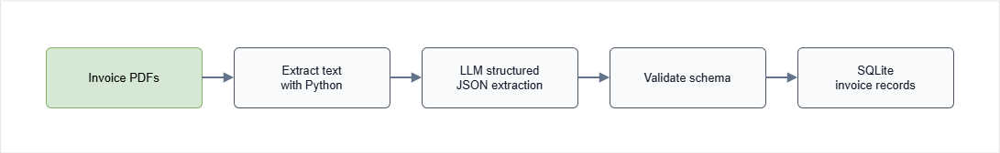

# AI Invoice Processing Pipeline

## Overview

This project automates invoice processing using PDF parsing, AI-powered data extraction, and database storage.

Instead of manually reviewing invoices, the workflow extracts key information from PDF documents and converts it into structured records that can be stored and processed automatically.

The goal is to transform unstructured invoice documents into structured data that can be used by other systems.

## Workflow 

The workflow processes invoices in multiple steps.

1. Load one or more PDF invoices              
2. Extract text from each PDF                 
3. Send the text to an LLM                    
4. Extract invoice details as structured JSON 
5. Store the extracted data in SQLite         

<!-- Each step has a single responsibility, which makes the workflow easier to understand and maintain. -->

The diagram below shows the end-to-end invoice processing path from PDF input to stored structured records.

<div class='img-center'>



</div>

### 1. Using Code to Extract Content 

Before sending data to an LLM, the workflow extracts text directly from the PDF using Python. While this can be done with an LLM, it is more efficient to use code for this step because:

- It reduces AI requests
- It reduces processing costs
- It keeps the workflow simple

Since PDF text extraction can be performed locally, there is no need to use an LLM for this task.

### 2. Structured Extraction 

After the text is extracted, it is sent to an LLM for invoice processing.

The model is responsible for identifying important invoice details such as:

- Vendor information
- Customer information
- Invoice number
- Invoice date
- Tax amount
- Total amount

Instead of returning free-form text, the model returns structured JSON that follows a predefined schema.

This structured output makes the extracted data easier to validate, store, and process.

### 3. Database Storage

After invoice data is extracted, the workflow stores the results in a SQLite database.

- Stores invoice records
- Supports future reporting
- Supports automation workflows
- Makes searching easier

The database becomes the final destination for the extracted invoice information.

**Note:** SQLite does not need a running database server, since it stores data in a local file:

```bash
invoices.db 
```


## Project Structure

```text
ai-invoice-processing-pipeline/
│
├── files
│   ├── invoice_001_northstar_cloud.pdf
│   ├── invoice_002_greenfield_office.pdf
│   ├── invoice_003_summit_security.pdf
│   ├── invoice_004_lumen_design.pdf
│   ├── invoice_005_evergreen_training.pdf
│   └── invoice_006_silverline_maintenance.pdf
│
├── prompts
│   └── extract_invoice_prompt.txt
│
├── schemas
│   └── invoice_schema.json
│
├── scripts
│   ├── create_invoices_table.sql
│   └── insert_invoice.sql
│
├── pyproject.toml
├── invoices.db
├── main.py
└── README.md
```

## Prerequisites

- [Python 3.11+](https://www.python.org/downloads/)
- [uv](https://docs.astral.sh/uv/getting-started/installation/)
- [An OpenAI account](https://platform.openai.com/login)
- [OpenAI API credentials](https://platform.openai.com/account/api-keys)


## Setup

1. Clone the repository

    ```bash
    git clone https://github.com/joseeden/llm-engineering-sandbox
    cd project-llm-engineering-sandbox/building-ai-workflows/07-ai-invoice-procesing-pipeline
    ```

2. Copy the environment file

    Create a `.env` file from the provided example:

    ```bash
    cp .env.example .env
    ```

3. Configure environment variables

    Open `.env` and update the values.

    **NOTE:** NEVER commit your real API keys to source control.

    ```env
    OPENAI_API_KEY=your_openai_key_here
    OPENAI_BASE_URL="https://api.openai.com/v1/responses"

    MODEL_NAME=your_model_name_here
    ```

4. Install UV 

    Linux / macOS

    ```bash
    curl -LsSf https://astral.sh/uv/install.sh | sh
    ```

    Verify installation:

    ```bash
    uv --version
    ```

5. Install SQLite CLI (Optional, for database validation)

    Linux / macOS

    ```bash
    sudo apt update -y
    sudo apt install -y sqlite3
    ```

6. Install Dependencies

    From the project directory, run:

    ```bash
    uv sync
    ```

    This will:

    1. Create a virtual environment if needed
    2. Install all project dependencies
    3. Use the versions locked in `uv.lock`

### Prompts

The workflow stores prompts in the `prompts/` directory.

```text
prompts/
└── extract_invoice_prompt.txt
```

The prompt contains the instructions used by the LLM to extract invoice information from the PDF content.

During execution, the application:

1. Extracts text from the PDF
2. Loads the prompt template
3. Inserts the extracted PDF content into the prompt
4. Sends the completed prompt to the LLM

The prompt could be written directly in `main.py`, but it is stored in a separate file to keep the application code cleaner and make prompt updates easier to manage.

### Schema

The workflow uses a JSON schema stored in:

```text
schemas/invoice_schema.json
```

The schema defines the exact structure that the LLM must return.

Example:

```json
{
  "invoiceNumber": "INV-2026-001",
  "date": "2026-06-01",
  "totalAmount": 1836.65,
  "tax": 151.65
}
```

The schema is used when calling the OpenAI API through Structured Outputs.

A schema is used to enforce a consistent response format from the LLM, which is critical for reliable data extraction.

- Produces consistent responses
- Reduces parsing errors
- Makes database storage predictable

By storing the schema in a separate file, the extraction rules can be updated without modifying the application code.


### Scripts

The workflow stores SQL statements in the `scripts/` directory.

```text
scripts/
├── create_invoices_table.sql
└── insert_invoice.sql
```

The SQL scripts could be written directly in `main.py`, but they are stored in separate files to improve organization and make the SQL easier to maintain.

- Separates application logic from database logic
- Allows SQL changes without modifying Python code

The scripts: 

1. `create_invoices_table.sql`

    This script creates the SQLite table used to store invoice data.

    The application loads and executes this script during startup:

    ```python
    setup_database()
    ```

    This ensures the required database structure exists before processing invoices.

2. `insert_invoice.sql`

    This script inserts extracted invoice data into the database.

    The application loads this script whenever a new invoice is processed:

    ```python
    insert_invoice_data()
    ```


### Sample Invoice Files

The project includes sample invoice PDFs in the `files/` directory.

```text
files/
├── invoice_001_northstar_cloud.pdf
├── invoice_002_greenfield_office.pdf
├── invoice_003_summit_security.pdf
├── invoice_004_lumen_design.pdf
├── invoice_005_evergreen_training.pdf
└── invoice_006_silverline_maintenance.pdf
```

These invoices contain fictional data and are provided for testing and demonstration purposes.

Each invoice contains:

- Vendor information
- Customer information
- Invoice number
- Invoice date
- Multiple line items
- Tax amount
- Total amount

The sample invoices allow the workflow to be tested end to end without requiring real business documents.


## Run the Application

```bash
uv run python main.py files
```

The application will process all PDF files in the `files/` directory, extract invoice details using the LLM, and store the results in the `invoices.db` SQLite database.

<div class='img-center'>


</div>

## Validation 

After running the application, you can validate that the invoice data was extracted and stored correctly by querying the SQLite database.

1. Verify that the output was structured correctly. 

    The output confirms that the model is returning structured JSON with the expected fields.

    ```json
    {
      "vendor": {
        "name": "Northstar Cloud Services Pte Ltd",
        "address": "18 Collyer Quay, #11-02, Singapore 049318",
        "taxId": "SG-UEN 202412345M"
      },
      "customer": {
        "name": "Harborlane Retail Group",
        "address": "42 Tanjong Pagar Road, Singapore 088463",
        "taxId": "SG-UEN 201998877H"
      },
      "invoiceNumber": "INV-2026-001",
      "date": "2026-06-01",
      "totalAmount": 1836.65,
      "tax": 151.65
    }
    ```

2. Check the number of records in the `invoices` table:

    ```bash
    sqlite3 invoices.db "SELECT COUNT(*) FROM invoices;"
    ```

    Output:

    ```bash
    6 
    ```

3. View the actual records in the `invoices` table:

    ```bash
    sqlite3 -header -column invoices.db \
    "SELECT invoice_number, vendor_name, customer_name, total_amount, tax FROM invoices;"
    ```

    Output:

    ```text
    invoice_number  vendor_name                        customer_name               total_amount  tax   
    --------------  ---------------------------------  --------------------------  ------------  ------
    INV-2026-001    Northstar Cloud Services Pte Ltd   Harborlane Retail Group     1836.65       151.65
    INV-2026-002    Greenfield Office Supplies         Cedar Peak Analytics        702.83        58.03 
    INV-2026-003    Summit Security Consulting         Bluewave Logistics Pte Ltd  3052.0        252.0 
    INV-2026-004    Lumen Creative Design Studio       Orchid Bay Foods            2387.1        197.1 
    INV-2026-005    Evergreen Technical Training       Atlas Manufacturing Asia    2376.2        196.2 
    INV-2026-006    Silverline Facilities Maintenance  Meridian Workspace Co.      1775.61       146.61
    ```

## Use Case 

Many business documents contain valuable information, but that information is often locked inside PDFs.

This workflow combines PDF processing, structured AI outputs, and database storage to automatically convert invoice documents into structured records.

The result is a simple AI-powered document processing pipeline that can be extended to support reporting, analytics, automation, or integrations with other systems.
