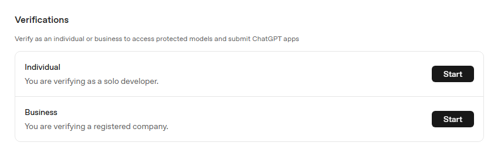

# AI Content Publishing Workflow

## Overview 

This project automates a simple content publishing workflow using AI.

It can generate a blog post from an outline, evaluate the result, improve the draft, generate a thumbnail image, and create a LinkedIn post based on the final article.

## Workflow

The workflow processes content in multiple steps.

1. Load a blog post outline
2. Load example blog posts
3. Generate a blog post using an LLM
4. Evaluate the generated article
5. Improve the article if needed
6. Generate a thumbnail image
7. Generate a LinkedIn post
8. Save all outputs to local files

Each step has a single responsibility, which makes the workflow easier to understand and maintain.

## Use Case

Creating content usually involves more than writing the article.

A complete publishing workflow may also require review, editing, thumbnails, and social media posts.

This project shows how AI can help automate those supporting steps while still keeping the final content easy to review and edit.

## Project Structure

```text
ai-content-publishing-workflow/
│
├── linkedin-post-examples
│   ├── cloud-computing.txt
│   └── devops.txt

├── outlines
│   └── sample-outline.txt
│
├── posts-examples
│   ├── cybersecurity-basics.mdx
│   ├── iot-edge-monitoring.md
│   └── running-consistency.mdx
│
├── prompts
│   ├── article_developer_prompt.txt
│   ├── article_improvement_prompt.txt
│   ├── article_user_prompt.txt
│   ├── evaluation_developer_prompt.txt
│   ├── evaluation_user_prompt.txt
│   ├── linkedin_developer_prompt.txt
│   ├── linkedin_user_prompt.txt
│   └── thumbnail_prompt.txt
│
├── posts-to-publish/
├── thumbnails/
├── linkedin-posts/
│
├── pyproject.toml
├── main.py
└── README.md
```

## Prerequisites

- [Python 3.11+](https://www.python.org/downloads/)
- [uv](https://docs.astral.sh/uv/getting-started/installation/)
- [An OpenAI account](https://platform.openai.com/login)
- [OpenAI API credentials](https://platform.openai.com/account/api-keys)

## Setup

1. Clone the repository

    ```bash
    git clone https://github.com/joseeden/llm-engineering-sandbox
    cd project-llm-engineering-sandbox/building-ai-workflows/10-ai-content-publishing-pipeline
    ```

2. Copy the environment file

    Create a `.env` file from the provided example:

    ```bash
    cp .env.example .env
    ```

3. Configure environment variables

    Open `.env` and update the values.

    **NOTE:** NEVER commit your real API keys to source control.

    ```env
    OPENAI_API_KEY=your_openai_key_here
    OPENAI_BASE_URL="https://api.openai.com/v1"

    MODEL_NAME=gpt-4.1-mini
    ```

    **Note 1:** The OpenAI SDK automatically appends the correct endpoint paths based on the method being called, so the base URL should just be this.

    **Note 2:** You can use other models that support image generation,such as `gpt-4.1` or `gpt-5-nano`, but `gpt-4.1-mini` is a good option for testing since it is cheaper and still supports image generation. 

    See [Pricing: Image generation models](https://developers.openai.com/api/docs/pricing?tab=models#image-tokens) 

4. Install UV 

    Linux / macOS

    ```bash
    curl -LsSf https://astral.sh/uv/install.sh | sh
    ```

    Verify installation:

    ```bash
    uv --version
    ```


5. Install Dependencies

    From the project directory, run:

    ```bash
    uv sync
    ```

    This will:

    1. Create a virtual environment if needed
    2. Install all project dependencies
    3. Use the versions locked in `uv.lock`


### Image Generation Requirements

The thumbnail generation step uses OpenAI's image generation API.

To use image generation models such as `gpt-image-1`, your OpenAI organization must be verified.

Without verification, image generation requests may fail even if text generation works correctly.

Before running the thumbnail generation step:

1. Open the OpenAI Platform
2. Navigate to Organization Settings
3. Complete the verification process
4. Confirm that image generation is enabled for your account

<div class='img-center'>



</div>


### Prompts

The workflow stores prompts in the `prompts/` directory.

The prompts define the behavior for each AI step:

- Article generation
- Article evaluation
- Article improvement
- Thumbnail generation
- LinkedIn post generation

The prompts are externalized to keep the Python code clean and make prompt changes easier to manage.

```bash
├── prompts
│   ├── article_developer_prompt.txt
│   ├── article_improvement_prompt.txt
│   ├── article_user_prompt.txt
│   ├── evaluation_developer_prompt.txt
│   ├── evaluation_user_prompt.txt
│   ├── linkedin_developer_prompt.txt
│   ├── linkedin_user_prompt.txt
│   └── thumbnail_prompt.txt
```

### Example Posts

The `posts-examples/` directory contains previous blog posts.

These are used as writing style references for the article generation and improvement steps.

The model should follow the tone, structure, and formatting style of the examples, but it should not copy their content.

```bash
├── posts-examples
│   ├── cybersecurity-basics.mdx
│   ├── iot-edge-monitoring.md
│   └── running-consistency.mdx 
```

### LinkedIn Post Examples

The `linkedin-post-examples/` directory contains sample LinkedIn posts.

These examples help the model generate a LinkedIn post in a similar writing style.

```bash
├── linkedin-post-examples
│   ├── cloud-computing.txt
│   └── devops.txt
```

### Outputs

The workflow saves generated outputs into separate folders.

```text
posts-to-publish/

thumbnails/

linkedin-posts/
```

The blog post is saved as Markdown.

The thumbnail is saved as a JPEG image.

The LinkedIn post is saved as a text file.


## Run the Application

Run the full workflow (with thumbnail generation):

```bash
uv run python main.py outlines/sample-outline.txt
```

Sample output:

> Loading outline: outlines/sample-outline.txt
> Generating blog post...
> Evaluating blog post...
> Evaluation result:
> Needs improvement: False
> 
> Feedback: The article is clear, well-structured, and easy to read. It follows the outline without copying it directly, uses simple language and short paragraphs, and explains the benefits and trade-offs of running local AI models effectively. Bullet points are not used, but the flow remains logical and concise. Overall, the post meets the requirements and does not need improvement.
> 
> Saving blog post: posts-to-publish/15062026-why-running-local-ai-models-is-useful-for-developers-02.md
> 
> Generating thumbnail...
> Saving thumbnail: thumbnails/15062026-why-running-local-ai-models-is-useful-for-developers-02.jpeg
> 
> Generating LinkedIn post...
> Saving LinkedIn post: linkedin-posts/15062026-why-running-local-ai-models-is-useful-for-developers-02.txt
> 
> Workflow completed.


## Skipping Steps

The workflow is designed to allow skipping certain steps. 

This is useful for testing or if you only want to generate specific outputs.

If you want to skip the LinkedIn post generation:

```bash
uv run python main.py outlines/sample-outline.txt --skip-linkedin
```

To skip thumbnail generation:

```bash
uv run python main.py outlines/sample-outline.txt --skip-thumbnail
```

To skip both thumbnail and LinkedIn post generation:

```bash
uv run python main.py outlines/sample-outline.txt --skip-thumbnail --skip-linkedin
```

**Note:** Thumbnail generation is optional because it requires image generation capabilities, which may not be available in all OpenAI accounts.

- Image generation costs money.
- Image generation requires verification.
- Some users may only want the blog article and LinkedIn post.

You can simply run the workflow without the thumbnail (skip thumbnail generation) step if you don't need it.

To run just the thumbnail generation step for testing:

```bash
uv run python main.py outlines/sample-outline.txt --generate-thumbnail
``` 


## Validation

After running the workflow, check that the output files were created.

Example:

```text
├── posts-to-publish
│   └── 15062026-why-running-local-ai-models-is-useful-for-developers-01.md
│
├── thumbnails
│   └── 15062026-why-running-local-ai-models-is-useful-for-developers-01.jpeg
│
├── linkedin-posts
│   └── 15062026-why-running-local-ai-models-is-useful-for-developers-01.txt
```

Open each file and review the output.

The generated article, thumbnail, and LinkedIn post should be treated as starting points. 

They should still be reviewed before publishing.
