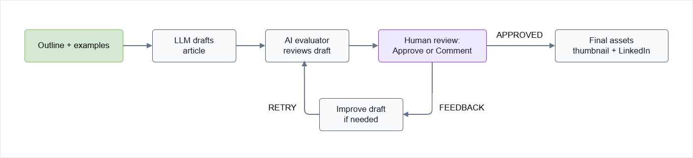

# AI Content Workflow with HITL

## Overview 

This project is an enhancement of the previous **AI Content Publishing Workflow**.

The previous workflow generated multiple content assets from a single outline:

- Blog post
- Thumbnail image
- LinkedIn post

This version adds a **review and feedback stage**, which allows the generated blog post to be evaluated, accepted, or improved before the final publishing assets are created.

The goal is to create a **human-in-the-loop** workflow where AI can generate and review content, while the user still controls the final output.

## Workflow

The workflow processes content in multiple steps.

1. Load a blog post outline
2. Load example blog posts
3. Generate a blog post draft
4. Evaluate the generated draft
5. Allow human review and feedback
6. Improve the draft if needed
7. Generate a thumbnail image
8. Generate a LinkedIn post
9. Save all generated outputs

<!-- Each step has a single responsibility, which makes the workflow easier to understand and maintain. -->

The diagram below shows where the human review loop fits into the content generation workflow.

<div class='img-center'>



</div>

### 1. Outline Processing

The workflow starts by loading a text file that contains the outline for a new article.

The outline defines:

- Topic
- Main ideas
- Writing direction

The outline acts as the source material for the workflow.

### 2. Blog Post Generation

The outline and example blog posts are sent to an LLM.

The model generates a complete article that:

- Follows the outline
- Adopts the writing style from the examples
- Produces Markdown output

The generated article becomes the first draft.

### 3. Draft Evaluation

After generating the draft, a second AI step evaluates the article.

The evaluator reviews:

- Readability
- Structure
- Clarity
- Overall quality

The evaluation returns structured feedback that tells the workflow whether the article needs improvement.

### 4. Human Review Loop

The workflow allows human feedback before generating a new version.

The user can:

- Press ENTER to accept the AI evaluation
- Type `accept` to accept the article as is
- Enter custom feedback to improve the article

This creates a human-in-the-loop workflow where AI and human reviewers collaborate on the final result.

### 5. Blog Post Improvement

If the article needs improvement, the workflow sends the draft, outline, and feedback back to the LLM.

The model then generates an improved version of the article.

The review cycle can repeat up to the configured maximum number of review cycles.

### 6. Thumbnail Generation

After the article is finalized, the workflow generates a thumbnail image.

The image is generated using an image generation model and is based on the final article content.

The generated thumbnail can be used as:

- Blog cover image
- Social media image
- Documentation header image

### 7. LinkedIn Post Generation

The workflow also generates a LinkedIn post based on the final article.

The LinkedIn post uses example LinkedIn posts as style references.

### 8. Parallel Asset Generation

After the blog post is finalized, thumbnail generation and LinkedIn post generation run in parallel.

This helps reduce total processing time because both outputs can be created at the same time.

## Use Case

Content creation usually involves more than writing the article.

A normal publishing workflow may include:

- Writing an article
- Reviewing the content
- Editing based on feedback
- Creating a thumbnail
- Writing a LinkedIn post

This project automates those steps while still keeping a human review stage in the process.

This makes the workflow useful for generating content faster without fully removing human control.

## Project Structure

```text
ai-content-publishing-workflow/
│
├── linkedin-post-examples
│   ├── cloud-computing.txt
│   └── devops.txt
│ 
├── outlines
│   └── sample-outline.txt
│
├── posts-examples
│   ├── cybersecurity-basics.mdx
│   ├── iot-edge-monitoring.md
│   └── running-consistency.mdx
│
├── prompts
│   ├── article_developer_prompt.txt
│   ├── article_improvement_prompt.txt
│   ├── article_user_prompt.txt
│   ├── evaluation_developer_prompt.txt
│   ├── evaluation_user_prompt.txt
│   ├── linkedin_developer_prompt.txt
│   ├── linkedin_user_prompt.txt
│   └── thumbnail_prompt.txt
│
├── posts-to-publish/
├── thumbnails/
├── linkedin-posts/
│
├── pyproject.toml
├── main.py
└── README.md
```

## Prerequisites

- [Python 3.11+](https://www.python.org/downloads/)
- [uv](https://docs.astral.sh/uv/getting-started/installation/)
- [An OpenAI account](https://platform.openai.com/login)
- [OpenAI API credentials](https://platform.openai.com/account/api-keys)

## Setup

1. Clone the repository

    ```bash
    git clone https://github.com/joseeden/llm-engineering-sandbox
    cd project-llm-engineering-sandbox/building-ai-workflows/11-ai-content-workflow-with-hitl
    ```

2. Copy the environment file

    Create a `.env` file from the provided example:

    ```bash
    cp .env.example .env
    ```

3. Configure environment variables

    ```env
    OPENAI_API_KEY=your_openai_api_key_here

    MODEL_NAME=gpt-4o-mini
    IMAGE_MODEL_NAME=gpt-image-1
    ```

    You can use other models for this lab, but make sure to update the environment variables accordingly.

    **Note:** The OpenAI SDK automatically appends the correct endpoint paths based on the method being called, so the base URL should just be this.

4. Install UV 

    Linux / macOS

    ```bash
    curl -LsSf https://astral.sh/uv/install.sh | sh
    ```

    Verify installation:

    ```bash
    uv --version
    ```

5. Install dependencies

    From the project directory, run:

    ```bash
    uv sync
    ```

    This will:

    1. Create a virtual environment if needed
    2. Install all project dependencies
    3. Use the versions locked in `uv.lock`

### Prompts

The workflow stores prompts in the `prompts/` directory.

```text
prompts/
├── article_developer_prompt.txt
├── article_user_prompt.txt
├── article_improvement_prompt.txt
├── evaluation_developer_prompt.txt
├── evaluation_user_prompt.txt
├── thumbnail_prompt.txt
├── linkedin_developer_prompt.txt
└── linkedin_user_prompt.txt
```

Each prompt file controls one part of the workflow.

| Prompt File                       | Purpose                                 |
| --------------------------------- | --------------------------------------- |
| `article_developer_prompt.txt`    | Defines the blog writing behavior       |
| `article_user_prompt.txt`         | Generates the first blog post draft     |
| `article_improvement_prompt.txt`  | Improves the article using feedback     |
| `evaluation_developer_prompt.txt` | Defines the article evaluation behavior |
| `evaluation_user_prompt.txt`      | Evaluates the generated article         |
| `thumbnail_prompt.txt`            | Generates the thumbnail prompt          |
| `linkedin_developer_prompt.txt`   | Defines the LinkedIn writing behavior   |
| `linkedin_user_prompt.txt`        | Generates the LinkedIn post             |

The prompts could be written directly in `main.py`, but they are stored separately to keep the Python code cleaner and make prompt updates easier to manage.

### Example Blog Posts

The workflow uses example blog posts stored in:

```text
posts-examples/
├── cybersecurity-basics.mdx
├── iot-edge-monitoring.md
└── running-consistency.mdx
```

These files act as style references for the model.

The examples help the model learn:

- Writing style
- Article structure
- Tone
- Formatting

The content itself should not be copied into the generated article.

### Example LinkedIn Posts

The workflow uses example LinkedIn posts stored in:

```text
linkedin-post-examples/
├── cloud-computing.txt
└── devops.txt
```

These examples help the model generate a LinkedIn post with a similar writing style.

### Review Stage

<!-- This version adds a human-in-the-loop review stage. -->

After the AI evaluates the blog post, the script asks for user input.

```text
Press ENTER to use the AI evaluation.
Type 'accept' to accept the article as is.
Or type your own feedback to improve the article.
```

This allows the user to decide whether the draft should be accepted or improved.

If feedback is provided, the script sends the article back to the LLM for revision.

## Run the Application

```bash
uv run python main.py outlines/sample-outline.txt
```

The workflow saves generated files into separate folders.

```text
posts-to-publish/
thumbnails/
linkedin-posts/
```

To skip thumbnail generation:

```bash
uv run python main.py outlines/sample-outline.txt --skip-thumbnail
```

To skip LinkedIn post generation:

```bash
uv run python main.py outlines/sample-outline.txt --skip-linkedin
```


## Validation

After running the workflow, verify that the output files were created.

1. The generated Markdown file should contain the final reviewed blog post.

2. The generated JPEG file should contain the thumbnail image.

3. The generated text file should contain the LinkedIn post.


## Review the Content

Before publishing, review the generated outputs and confirm that:

1. The article follows the outline
2. The article follows the example writing style
3. The article has been reviewed
4. The feedback was applied if provided
5. The thumbnail matches the article topic
6. The LinkedIn post summarizes the article clearly
