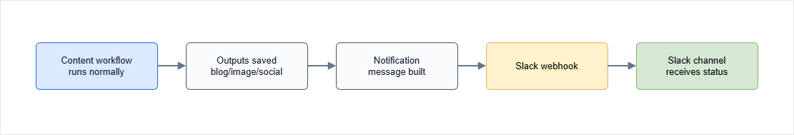
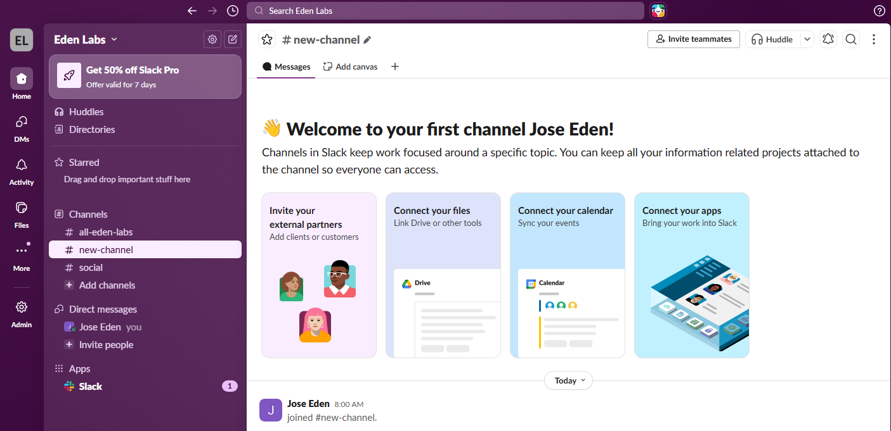
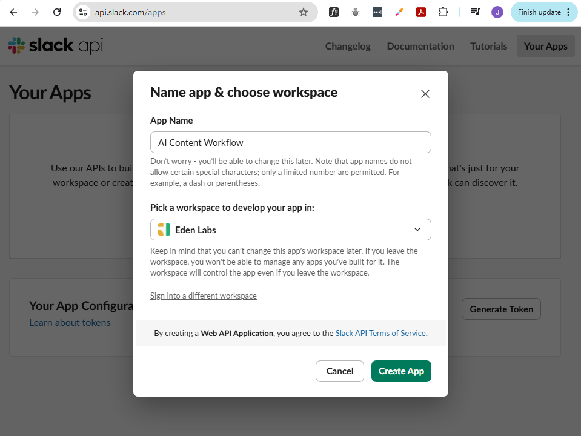
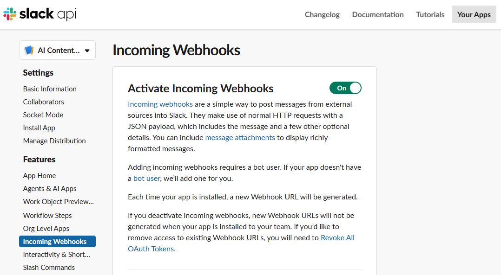
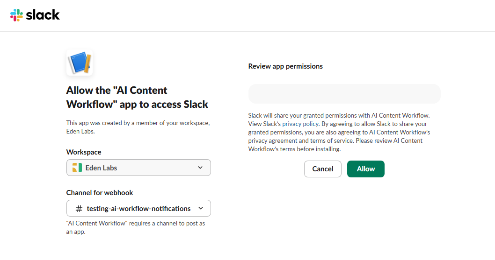
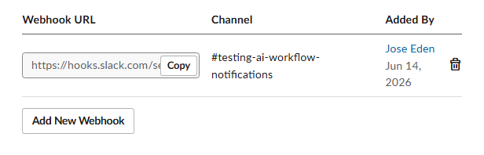
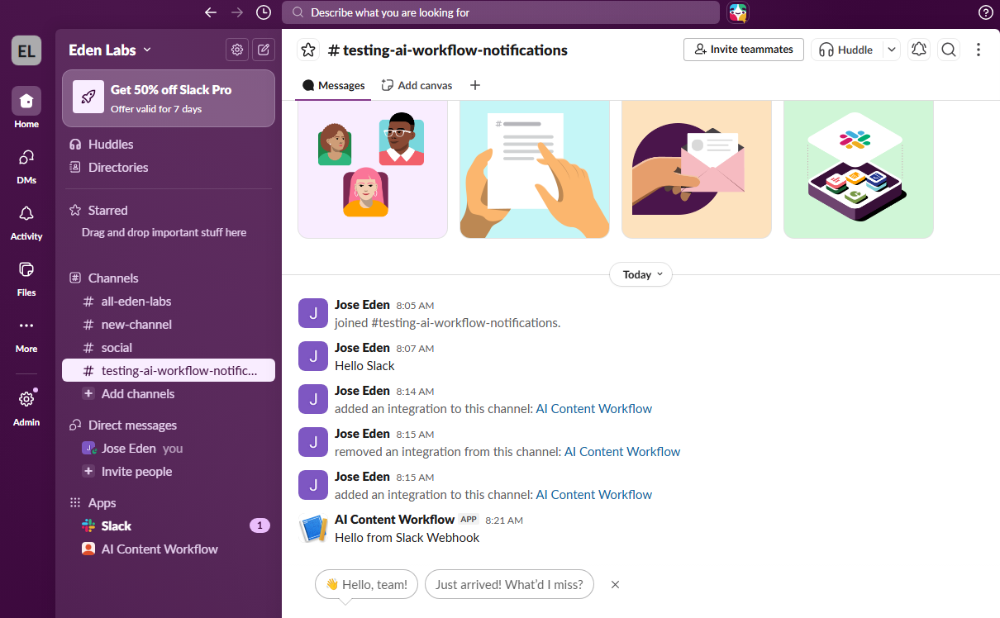
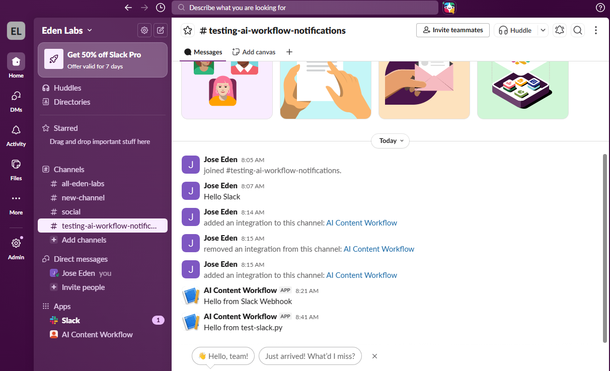
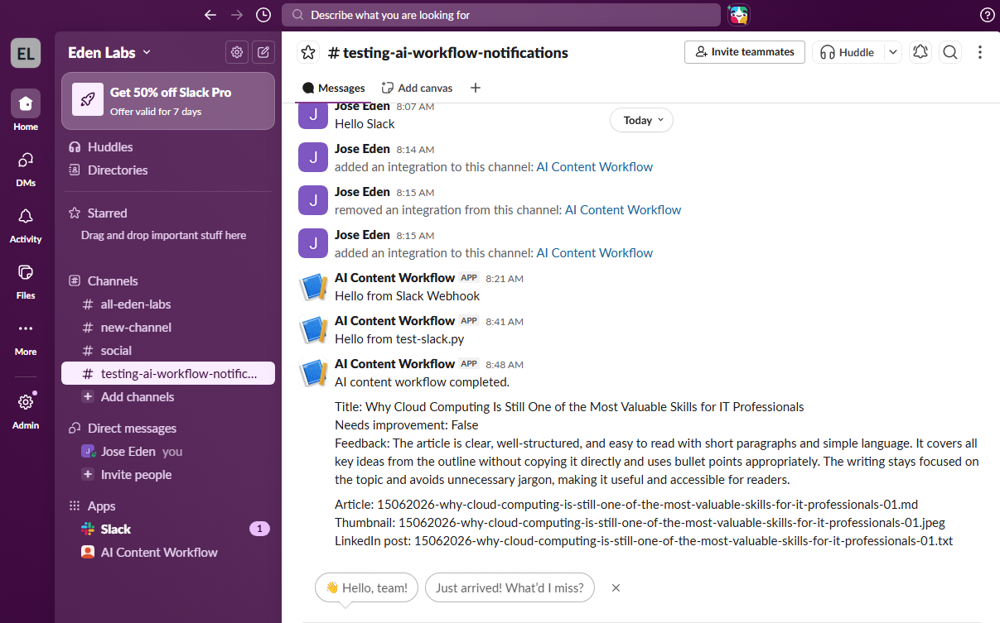

# Slack Integration for AI Workflows

## Overview 

This project extends the [AI Content Publishing Workflow](https://github.com/joseeden/llm-engineering-sandbox/blob/master/building-ai-workflows/10-ai-content-publishing-pipeline/README.md) by adding Slack notifications.

The original workflow generates:

- A blog post
- A thumbnail image
- A LinkedIn post

This version performs the same content generation workflow and then sends a notification to a Slack channel when the workflow completes.


## Workflow

The workflow processes content in multiple steps.

1. Load a blog post outline
2. Load example blog posts
3. Generate a blog post using an LLM
4. Evaluate the generated article
5. Improve the article if needed
6. Generate a thumbnail image
7. Generate a LinkedIn post
8. Save all outputs to local files
9. Send a Slack notification

<!-- Each step has a single responsibility, which makes the workflow easier to understand and maintain. -->

The diagram below shows how the content workflow connects to the Slack notification step after the generated assets are saved.

<div class='img-center'>



</div>

## Project Structure

```text
slack-integration-for-ai-workflows/
│
├── linkedin-post-examples
│   ├── cloud-computing.txt
│   └── devops.txt

├── outlines
│   ├── outline-cloud-computing.txt
│   ├── outline-marathon.txt
│   └── outline-ruby.txt
│
├── posts-examples
│   ├── cybersecurity-basics.mdx
│   ├── iot-edge-monitoring.md
│   └── running-consistency.mdx
│
├── prompts
│   ├── article_developer_prompt.txt
│   ├── article_improvement_prompt.txt
│   ├── article_user_prompt.txt
│   ├── evaluation_developer_prompt.txt
│   ├── evaluation_user_prompt.txt
│   ├── linkedin_developer_prompt.txt
│   ├── linkedin_user_prompt.txt
│   └── thumbnail_prompt.txt
│
├── posts-to-publish/
├── thumbnails/
├── linkedin-posts/
│
├── pyproject.toml
├── test-slack.py
├── main.py
└── README.md
```

## Prerequisites

Slack setup: 

- [A Slack account](https://slack.com/get-started#/createnew)
- [A Slack workspace](https://slack.com/intl/en-sg/help/articles/206845317-Create-a-Slack-workspace)

Environment setup: 

- [Python 3.11+](https://www.python.org/downloads/)
- [uv](https://docs.astral.sh/uv/getting-started/installation/)
- [An OpenAI account](https://platform.openai.com/login)
- [OpenAI API credentials](https://platform.openai.com/account/api-keys)


## Slack Setup 

1. Go to the [Slack](https://slack.com/get-started) website.

    Create an account if you don't have one.

    You can sign up using:

    - Google account
    - Apple account
    - Email address

2. Verify your email if prompted.

    After verification, Slack will ask whether you want to:

    - Join an existing workspace
    - Create a new workspace

    You can choose to create a new workspace for testing purposes.

3. Create a Slack Workspace

    A workspace is Slack's equivalent of:

    - Discord Server
    - Microsoft Teams Organization
    - Telegram Group

    When prompted, provide your workspace name and personal name.

    You can skip inviting teammates for now.

4. View the new workspace

    Once done, you will be taken to your new Slack workspace.

    <div class='img-center'>

    

    </div>


5. Create a test channel

    Look at the **Channel** sidebar on the left, then click the "+" button.

    Provide a channel name:

    ```text
    testing-ai-workflow-notifications
    ```

    You can keep it public for now (anyone in the workspace can see it).

    Click **Create**

6. Send a test message manually

    Open the new channel and send a simple message.

    ```text
    Hello Slack
    ```

    Verify that:

    - You can post messages
    - The channel exists
    - You have access

    Do not continue until this works.


7. Create a Slack Developer App

    In a new tab, go to the Slack Developer Portal:

    ```text
    https://api.slack.com/apps
    ```

    This is completely separate from normal Slack.

    Click **Create an App** ➜ **From Scratch**

8. Configure the App

    Provide an app name and choose the workspace you just created.

    ```text
    AI Content Workflow
    ```

    Then click **Create App.**

    ```text
    Create App
    ```

    <div class='img-center'>

    

    </div>

    You now have a Slack application.

    At this point, you still cannot send messages.

    The app exists, but has no permissions yet.


9. Enable incoming webhooks

    Inside the app, go to **Features** → **Incoming Webhooks**

    Toggle **Activate Incoming Webhooks**

    <div class='img-center'>

    

    </div>


10. Create the Webhook

    Still in the same page, scroll down and click **Add New Webhook**

    Choose the workspace and channel you want to post to.

    Then click **Allow.**

    <div class='img-center'>

    

    </div>

11. Copy the Webhook URL

    Back in the **Incoming Webhooks** section, you should see your newly created webhook URL. Copy it.

    ```text
    https://hooks.slack.com/services/TXXXXX/BXXXXX/XXXXXXXXXXXXXXXX
    ```

    This URL is your Slack password for this integration.

    Anyone with this URL can post into your channel.

    **NOTE:**

    - Never commit it to GitHub.
    - Never put it in documentation.
    - Never share screenshots showing it.

    <div class='img-center'>

    

    </div>


12. Test the webhook before integration 

    Open a terminal and save the webhook URL in an environment variable:

    ```bash
    export SLACK_WEBHOOK_URL="PASTE_WEBHOOK_URL_HERE"
    ```

    Run:

    ```bash
    curl -X POST \
      -H "Content-Type: application/json" \
      --data '{"text":"Hello from Slack Webhook"}' \
      "$SLACK_WEBHOOK_URL"
    ```

    Expected response:

    ```text
    ok
    ```

13. Verify the message in Slack

    Back in your Slack channel, you should see the new message.

    The other steps you did should also appear as messages in the channel.

    <div class='img-center'>

    

    </div>


## Environment Setup

1. Clone the repository

    ```bash
    git clone https://github.com/joseeden/llm-engineering-sandbox

    cd project-llm-engineering-sandbox/building-ai-workflows/20-slack-integration-for-ai-workflows
    ```

2. Copy the environment file

    Create a `.env` file from the provided example:

    ```bash
    cp .env.example .env
    ```

3. Configure environment variables

    Open `.env` and update the values.

    **NOTE:** NEVER commit your real API keys to source control.

    ```env
    OPENAI_API_KEY=your_openai_key_here
    OPENAI_BASE_URL="https://api.openai.com/v1"

    MODEL_NAME=gpt-4.1-mini
    IMAGE_MODEL_NAME=gpt-image-1

    # Slack Integration Configuration
    SLACK_WEBHOOK_URL="https://hooks.slack.com/services/xxx/yyy/zzz"
    ```

    **Note 1:** The OpenAI SDK automatically appends the correct endpoint paths based on the method being called, so the base URL should just be this.

    **Note 2:** You can use other models that support image generation,such as `gpt-4.1` or `gpt-5-nano`, but `gpt-4.1-mini` is a good option for testing since it is cheaper and still supports image generation. 

    See [Pricing: Image generation models](https://developers.openai.com/api/docs/pricing?tab=models#image-tokens) 

4. Install UV 

    Linux / macOS

    ```bash
    curl -LsSf https://astral.sh/uv/install.sh | sh
    ```

    Verify installation:

    ```bash
    uv --version
    ```


5. Install Dependencies

    From the project directory, run:

    ```bash
    uv sync
    ```

    This will:

    1. Create a virtual environment if needed
    2. Install all project dependencies
    3. Use the versions locked in `uv.lock`
    4. 


### Image Generation Requirements

The thumbnail generation step uses OpenAI's image generation API.

To use image generation models such as `gpt-image-1`, your OpenAI organization must be verified.

Without verification, image generation requests may fail even if text generation works correctly.

Before running the thumbnail generation step:

1. Open the OpenAI Platform
2. Navigate to Organization Settings
3. Complete the verification process
4. Confirm that image generation is enabled for your account

<div class='img-center'>


</div>


### Prompts

The workflow stores prompts in the `prompts/` directory.

The prompts define the behavior for each AI step:

- Article generation
- Article evaluation
- Article improvement
- Thumbnail generation
- LinkedIn post generation

The prompts are externalized to keep the Python code clean and make prompt changes easier to manage.

```bash
├── prompts
│   ├── article_developer_prompt.txt
│   ├── article_improvement_prompt.txt
│   ├── article_user_prompt.txt
│   ├── evaluation_developer_prompt.txt
│   ├── evaluation_user_prompt.txt
│   ├── linkedin_developer_prompt.txt
│   ├── linkedin_user_prompt.txt
│   └── thumbnail_prompt.txt
```

### Example Posts

The `posts-examples/` directory contains previous blog posts.

These are used as writing style references for the article generation and improvement steps.

The model should follow the tone, structure, and formatting style of the examples, but it should not copy their content.

```bash
├── posts-examples
│   ├── cybersecurity-basics.mdx
│   ├── iot-edge-monitoring.md
│   └── running-consistency.mdx 
```

### LinkedIn Post Examples

The `linkedin-post-examples/` directory contains sample LinkedIn posts.

These examples help the model generate a LinkedIn post in a similar writing style.

```bash
├── linkedin-post-examples
│   ├── cloud-computing.txt
│   └── devops.txt
```

### Outlines 

The `outlines/` directory contains blog post outlines. 

These are basically the "topics" that you want to generate content for. 

Currently the workflow takes a single outline as input, but you could modify it to process multiple outlines in a batch if you want.

You can use the sample outlines, but you can also create your own.

```bash
outlines/
├── outline-cloud-computing.txt
├── outline-marathon.txt
└── outline-ruby.txt
```

### Outputs

The workflow saves generated outputs into separate folders.

```text
posts-to-publish/

thumbnails/

linkedin-posts/
```

The blog post is saved as Markdown.

The thumbnail is saved as a JPEG image.

The LinkedIn post is saved as a text file.

## Standalone Slack Test Script

Before adding the workflow, create a `test-slack.py` file to test the Slack integration separately.

Run the test script:

```bash
python test-slack.py
```

Output:

```text
Slack notification sent successfully.
```

Go to your Slack channel and verify that the test message was posted.

```bash
Hello from test-slack.py 
```

<div class='img-center'>



</div>

If this works, and you see the test message in your Slack channel, you can proceed to integrate the Slack notification into the main workflow.


## Run the Application

Run the full workflow (with thumbnail generation):

```bash
uv run python main.py outlines/outline-cloud-computing.txt
```

(You can choose a different outline from the `outlines/` directory if you want, or create your own.)

Sample output:

> Loading outline: outlines/outline-cloud-computing.txt
> Generating blog post...
> Evaluating blog post...
> Evaluation result:
> Needs improvement: False
> 
> Feedback: The article is clear, well-structured, and easy to read with short paragraphs and simple language. It covers all key ideas from the outline without copying it directly and uses bullet points appropriately. The writing stays focused on the topic and avoids unnecessary jargon, making it useful and accessible for readers.
> 
> Saving blog post: posts-to-publish/15062026-why-cloud-computing-is-still-one-of-the-most-valuable-skills-for-it-professionals-01.md
> 
> Generating thumbnail...
> Saving thumbnail: thumbnails/15062026-why-cloud-computing-is-still-one-of-the-most-valuable-skills-for-it-professionals-01.jpeg
> 
> Generating LinkedIn post...
> Saving LinkedIn post: linkedin-posts/15062026-why-cloud-computing-is-still-one-of-the-most-valuable-skills-for-it-professionals-01.txt
> 
> Sending Slack notification...
> 
> Workflow completed.


## Skipping Steps

The workflow is designed to allow skipping certain steps. 

This is useful for testing or if you only want to generate specific outputs.

If you want to skip the LinkedIn post generation:

```bash
uv run python main.py outlines/sample-outline.txt --skip-linkedin
```

To skip thumbnail generation:

```bash
uv run python main.py outlines/sample-outline.txt --skip-thumbnail
```

To skip both thumbnail and LinkedIn post generation:

```bash
uv run python main.py outlines/sample-outline.txt --skip-thumbnail --skip-linkedin
```

**Note:** Thumbnail generation is optional because it requires image generation capabilities, which may not be available in all OpenAI accounts.

- Image generation costs money.
- Image generation requires verification.
- Some users may only want the blog article and LinkedIn post.

You can simply run the workflow without the thumbnail (skip thumbnail generation) step if you don't need it.

To run just the thumbnail generation step for testing:

```bash
uv run python main.py outlines/sample-outline.txt --generate-thumbnail
``` 


## Validation

After running the workflow, check that the output files were created.

Example:

```bash
├── linkedin-posts
│   └── 15062026-why-cloud-computing-is-still-one-of-the-most-valuable-skills-for-it-professionals-01.txt
│ 
├── posts-to-publish
│   └── 15062026-why-cloud-computing-is-still-one-of-the-most-valuable-skills-for-it-professionals-01.md
│
├── thumbnails
│   └── 15062026-why-cloud-computing-is-still-one-of-the-most-valuable-skills-for-it-professionals-01.jpeg  
```

Open each file and review the output.

The generated article, thumbnail, and LinkedIn post should be treated as starting points. 

Lastly, check your Slack channel to verify that the notification was posted successfully.

<div class='img-center'>



</div>
